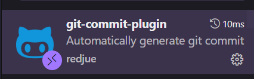

# Git 使用教程 

## 仓库与克隆

### 克隆远程仓库（多人协作的起点）
```bash
# 克隆仓库到本地
git clone https://github.com/用户名/项目名.git

# 克隆并指定本地目录名
git clone https://github.com/用户名/项目名.git 本地目录名
```

## 分支管理

### 分支基础操作
```bash
# 查看所有分支（本地和远程）
git branch -a

# 查看本地分支
git branch

# 查看远程分支
git branch -r

# 创建新分支
git branch 分支名

# 切换分支
git checkout 分支名

# 创建并切换分支（推荐）
git checkout -b 分支名

# 删除本地分支
git branch -d 分支名  # 安全删除（已合并的分支）
git branch -D 分支名  # 强制删除

# 删除远程分支
git push origin --delete 分支名
```

### 分支命名规范
- `main/master` - 主分支，生产环境代码
- `develop` - 开发分支，日常开发
- `feature/功能名` - 功能分支
- `bugfix/问题描述` - Bug 修复分支
- `hotfix/紧急修复` - 紧急修复分支
- `release/版本号` - 发布分支

## 多人协作核心操作

### 1. 拉取远程更新（重要！）

```bash
# 获取远程仓库最新信息（不合并）
git fetch origin

# 拉取并合并远程分支到当前分支
git pull origin 分支名

# 等同于 git fetch + git merge
git pull

# 使用 rebase 方式拉取（保持提交历史整洁）
git pull --rebase origin 分支名
```

### 2. 推送本地更新

```bash
# 推送到远程仓库
git push origin 分支名

# 首次推送分支并设置上游
git push -u origin 分支名

# 之后可以直接使用
git push

# 强制推送（谨慎使用！会覆盖远程）
git push -f origin 分支名
```

### 3. 分支合并

```bash
# 合并指定分支到当前分支
git merge 分支名

# 合并时创建合并提交（即使可以快进合并）
git merge --no-ff 分支名

# 中止合并
git merge --abort
```

## 冲突解决

### 冲突产生场景
- 多人修改同一文件的同一部分
- 合并分支时有不兼容的更改
- 拉取远程更新时本地有未提交的修改

### 解决冲突步骤

1. **拉取最新代码时遇到冲突**
```bash
git pull origin main
# 出现冲突提示
```

2. **查看冲突文件**
```bash
git status
# 会显示冲突的文件
```

3. **手动解决冲突**
打开冲突文件，会看到类似标记：
```
<<<<<<< HEAD
你的本地代码
=======
远程仓库的代码
>>>>>>> origin/main
```

4. **标记冲突已解决**
```bash
# 添加已解决的文件
git add 文件名

# 或添加所有已解决文件
git add .
```

5. **完成合并**
```bash
# 如果是 merge 冲突
git commit -m "解决合并冲突"

# 如果是 rebase 冲突
git rebase --continue
```

## 协作最佳实践

### 1. 日常工作流程

```bash
# 1. 开始新功能前，先更新主分支
git checkout main
git pull origin main

# 2. 创建功能分支
git checkout -b feature/新功能

# 3. 进行开发并提交
git add .
git commit -m "添加新功能"

# 4. 推送到远程
git push -u origin feature/新功能

# 5. 创建 Pull Request/Merge Request
# 在 GitHub/GitLab 上操作

# 6. 代码审查通过后合并到主分支
```

### 2. 提交前的检查

```bash
# 查看状态
git status

# 查看差异
git diff

# 查看暂存区差异
git diff --staged

# 查看提交历史
git log --oneline --graph --all
```

### 3. 保持同步的技巧

```bash
# 定期从主分支更新你的功能分支
git checkout feature/你的分支
git pull origin main

# 或使用 rebase 保持历史整洁
git rebase main
```

### 4. 提交信息规范

下载一个插件：git-commit-plugin



这个插件提供了良好的commit模板

良好的提交信息格式：
```
类型: 简短描述

详细说明（可选）

相关 issue #123
```

类型示例：
- `feat`: 新功能
- `fix`: 修复 bug
- `docs`: 文档更新
- `style`: 代码格式调整
- `refactor`: 重构
- `test`: 测试相关
- `chore`: 构建过程或辅助工具的变动

### 5. 紧急情况处理

```bash
# 暂存当前工作
git stash

# 切换到其他分支处理紧急任务
git checkout main

# 处理完后恢复暂存的工作
git checkout 原分支
git stash pop
```

## 常见问题

### Q1: 不小心提交到了错误的分支
```bash
# 撤销最后一次提交但保留更改
git reset --soft HEAD~1

# 切换到正确分支
git checkout 正确分支

# 重新提交
git add .
git commit -m "提交信息"
```

### Q2: 想要撤销已推送的提交
```bash
# 创建一个撤销提交
git revert 提交哈希

# 推送撤销
git push
```

### Q3: 本地分支落后于远程分支
```bash
# 方法1：合并
git pull origin 分支名

# 方法2：变基（推荐）
git pull --rebase origin 分支名
```

### Q4: 查看谁修改了某行代码
```bash
git blame 文件名
```

## 团队协作黄金法则

1. **频繁拉取**：每天开始工作前先 `git pull`
2. **小步提交**：频繁提交，每个提交只做一件事
3. **清晰的提交信息**：让别人能理解你做了什么
4. **及时推送**：完成功能后及时推送，避免代码丢失
5. **代码审查**：通过 Pull Request 进行代码审查
6. **保护主分支**：不直接在 main/master 分支上开发
7. **解决冲突**：遇到冲突及时沟通解决
8. **保持同步**：定期将主分支的更新合并到功能分支
